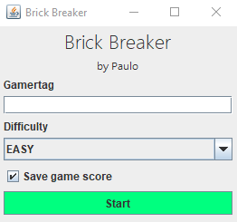
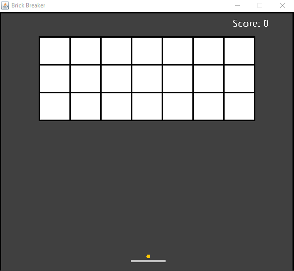
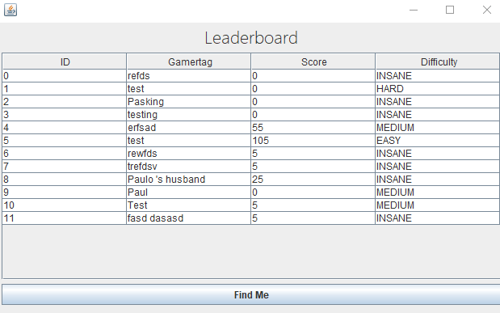

# BrickBreaker
A Java Swing based Brick Breaker game.

(Very old mini project that has been reformated for nostalgic purposes.)

## Features

* Simple & Easy GUI.
* Simple controls.
* Leaderboard system.
* 4 Difficulties: EASY, MEDIUM, HARD and INSANE.
* Wont slow/burn down your computer.

## Previews

 

 
